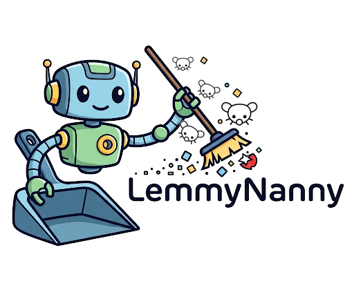
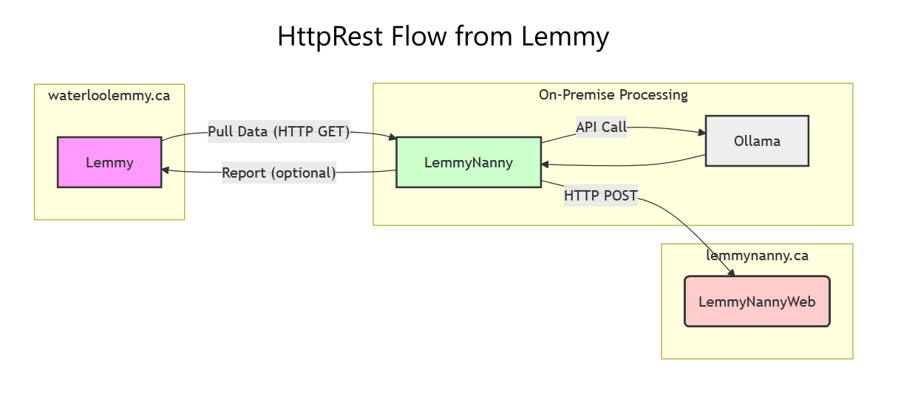
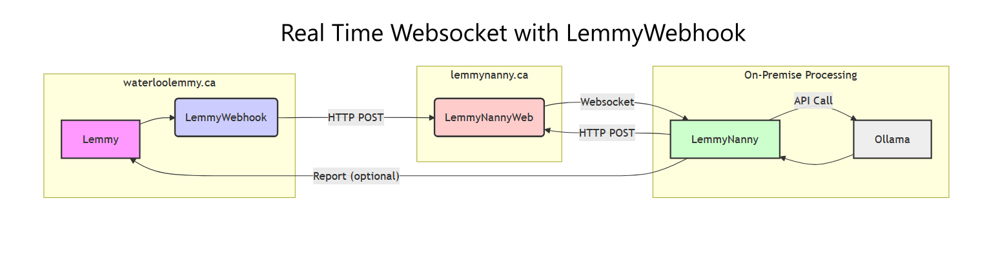

# LemmyNanny




LemmyNanny is a simple app to help monitor Lemmy instances using AI!

It's a highly configurable tool for any admin or mod. Choose your model and prompt, then let it rip!

If you have a username and password setup, it automatically sends a report for the post or comment it finds that offends the prompt.
Just configure `appsettings.json` and run the app!
```
{
  "LemmyUserName": "Username", <optional: used to report posts>
  "LemmyPassword": "SecretPassword", <optional: used to report posts>
  "LemmyHost": "http://localhost:8536", <example: https://lemmy.ml, or https://lemmy.ca>
  "OllamaUrl": "http://localhost:11434",
  "OllamaModel": "qwen2.5vl:7b",
  "SqliteDb": "LemmyNanny.db", <optional: creates a new DB if not exists>
  "Prompt": "You are a moderator of a social media forum, the following is a post. Validate that the content is not illegal to host, and that it doesn't violate common community rules.",
  "SortType": "Active", <optional: defaults to Active>
  "ListingType": "All" <optional: defaults to All> 
}

```
SortType and ListingType can be of the following:   
```
public enum SortType
{
    Active,
    Hot,
    MostComments,
    New,
    NewComments,
    Old,
    TopAll,
    TopDay,
    TopMonth,
    TopWeek,
    TopYear
}
```

```
public enum ListingType
{
    All,
    Community,
    Local,
    Subscribed
}
```

Made using
- .Net 8.0
- 🦙 ollama
- 🧑‍💻 dotNETLemmy
- 📅 SQLite

## Simple configuration


## More complex flow


## RealTime Websockets Mermaid.js markup
```mermaidjs
graph LR
    subgraph waterloolemmy.ca
        A[Lemmy] --> B(LemmyWebhook)
    end
    subgraph lemmynanny.ca
    B -- HTTP POST --> C(LemmyNannyWeb)
    end
    D -- HTTP POST --> C
    C -- Websocket --> D
    style A fill:#f9f,stroke:#333,stroke-width:2px
    style B fill:#ccf,stroke:#333,stroke-width:2px
    style C fill:#fcc,stroke:#333,stroke-width:2px
    style D fill:#cfc,stroke:#333,stroke-width:2px
    style E fill:#eee,stroke:#333,stroke-width:2px

    subgraph On-Premise Processing
      direction TB
      D[LemmyNanny] -- API Call --> E[Ollama]
      E --> D
      D -- Report (optional) --> A
    end

    classDef onprem fill:#eee,stroke:#333,stroke-width:2px
    class D,E onprem

    classDef blacktext text:#000000;
    class A,B,C,D,E blacktext;

```

## HTTP Request Mermaid.js markup
```mermaidjs
graph LR
    subgraph waterloolemmy.ca
        A[Lemmy]
    end
    subgraph lemmynanny.ca
    C(LemmyNannyWeb)
    end
    D -- HTTP POST --> C
    style A fill:#f9f,stroke:#333,stroke-width:2px
    style C fill:#fcc,stroke:#333,stroke-width:2px
    style D fill:#cfc,stroke:#333,stroke-width:2px
    style E fill:#eee,stroke:#333,stroke-width:2px

    subgraph On-Premise Processing
      direction TB
      D[LemmyNanny] -- API Call --> E[Ollama]
      E --> D
      D -- Report (optional) --> A
      A -- Pull Data (HTTP GET) --> D
    end

    classDef onprem fill:#eee,stroke:#333,stroke-width:2px
    class D,E onprem

    classDef blacktext text:#000000;
    class A,C,D,E blacktext;

```